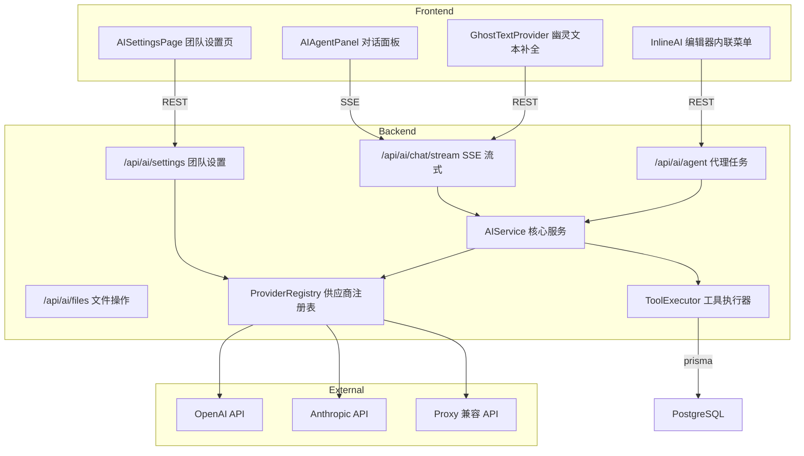

# AI Agent Coding - 技术设计文档

Feature Name: ai-agent-coding
Updated: 2026-06-22

## 描述

将 CodeZone 现有基础 AI 助手升级为具备项目感知、多步推理、文件操作能力的 AI Coding Agent，支持多 AI 供应商配置和团队级管控，并深度集成到 Monaco 代码编辑器中。

实施分三个阶段（P1/P2/P3），每个阶段可独立交付。

## 架构概览



## 阶段规划

### P1 - 核心 AI Agent 能力（本次实施）
- Requirement 1: 团队 AI 设置管理
- Requirement 3: AI 流式对话
- Requirement 4: AI Agent 项目上下文感知
- Requirement 8: AI 对话历史与持久化

### P2 - 编辑器集成与文件操作
- Requirement 5: AI Agent 文件操作
- Requirement 7: 编辑器深度集成
- Requirement 9: AI Agent 推理过程展示

### P3 - 终端命令与用量监控
- Requirement 2: AI 用量监控与配额控制
- Requirement 6: AI Agent 终端命令执行
- Requirement 10: 团队 AI 功能权限控制

## 数据模型

### 新增模型

#### TeamAISettings - 团队 AI 配置

| 字段 | 类型 | 说明 |
|------|------|------|
| id | String @id | CUID 主键 |
| teamId | String @unique | 关联 Team |
| provider | String @default("openai") | 供应商类型 (openai / anthropic / custom) |
| endpoint | String | API 端点 URL |
| apiKey | String | 加密存储的 API 密钥 |
| defaultModel | String | 默认模型 ID |
| enabledModels | Json | 启用的模型列表 ["model-a","model-b"] |
| parameters | Json | 默认参数 {temperature, maxTokens, topP} |
| isEnabled | Boolean @default(true) | 是否启用团队 AI |
| createdAt | DateTime |
| updatedAt | DateTime |

#### AIConversation - AI 对话

| 字段 | 类型 | 说明 |
|------|------|------|
| id | String @id | CUID 主键 |
| projectId | String | 关联 Project |
| userId | String | 对话创建者 |
| title | String | 对话标题（AI 自动生成） |
| modelId | String | 使用的模型 |
| createdAt | DateTime |
| updatedAt | DateTime |

#### AIMessage - 对话消息

| 字段 | 类型 | 说明 |
|------|------|------|
| id | String @id | CUID 主键 |
| conversationId | String | 关联 AIConversation |
| role | String | user / assistant / system / tool |
| content | String | 消息内容 |
| toolCalls | Json? | 工具调用记录（含推理过程） |
| tokenCount | Int? | token 用量 |
| createdAt | DateTime |

#### AIUsageLog - 用量记录（P3）

| 字段 | 类型 | 说明 |
|------|------|------|
| id | String @id | CUID 主键 |
| teamId | String | 关联 Team |
| userId | String | 调用用户 |
| modelId | String | 使用的模型 |
| promptTokens | Int | 输入 token |
| completionTokens | Int | 输出 token |
| createdAt | DateTime |

### 新增枚举

- `AIProvider`: OPENAI / ANTHROPIC / CUSTOM

## 组件与接口

### 后端组件

#### 1. ProviderRegistry (`backend/src/lib/ai/providers/registry.ts`)

供应商注册表，管理不同 AI 供应商的客户端适配。

```typescript
interface AIProvider {
  id: string;
  label: string;
  chat(messages: Message[], options: ChatOptions): AsyncIterable<string>;
  chatSync(messages: Message[], options: ChatOptions): Promise<string>;
  listModels(): Promise<ModelInfo[]>;
  validateConfig(config: AIConfig): Promise<boolean>;
}
```

#### 2. AIService 重构 (`backend/src/lib/ai/service.ts`)

从单一 `fetch` 调用升级为支持流式输出、多供应商切换和代理循环。

核心方法：
- `streamChat()` - 流式对话，返回 AsyncIterable
- `executeAgentTask()` - 执行代理任务（多轮推理 + 工具调用）
- `resolveProvider(config)` - 根据团队/系统配置选择供应商

#### 3. ContextCollector (`backend/src/lib/ai/context.ts`)

搜集项目上下文供 AI Agent 使用：
- `collectProjectContext(projectId, currentFileId?, selectedFileIds?)`
  - 返回文件树结构、当前文件内容、选中文件内容
  - 按 token 预算裁剪

#### 4. ToolExecutor (`backend/src/lib/ai/tools.ts`)

AI Agent 工具执行器，注册可用的工具：
- `read_file` - 读取项目文件
- `write_file` - 写入/创建文件
- `search_code` - 搜索代码
- `list_files` - 列出文件树
- `execute_command` - 执行终端命令（P3，需用户确认）

### API 路由变更

#### 增强 `/api/ai/chat/stream` (新增 SSE 端点)

```
POST /api/ai/chat/stream
Headers: Authorization Bearer <token>
Body: {
  conversationId?: string,
  projectId: string,
  messages: Message[],
  model?: string,
  contextFiles?: string[],    // 附加文件 ID
  tools?: string[]            // 启用的工具
}
Response: text/event-stream
  data: {"type":"token","content":"Hello"}
  data: {"type":"tool_call","tool":"read_file","args":{"fileId":"xxx"}}
  data: {"type":"tool_result","content":"..."}
  data: {"type":"done","conversationId":"xxx"}
  data: {"type":"error","message":"..."}
```

#### 新增 `/api/ai/settings` (团队 AI 设置)

```
GET    /api/ai/settings          - 获取当前团队 AI 配置
PUT    /api/ai/settings          - 更新团队 AI 配置 (OWNER/ADMIN)
POST   /api/ai/settings/validate - 验证 AI 配置是否有效
GET    /api/ai/models            - 获取可用模型列表
```

#### 新增 `/api/ai/conversations` (对话管理)

```
GET    /api/ai/conversations          - 获取项目的对话列表
POST   /api/ai/conversations          - 创建新对话
GET    /api/ai/conversations/:id      - 获取对话详情（含消息列表）
DELETE /api/ai/conversations/:id      - 删除对话
PATCH  /api/ai/conversations/:id      - 重命名对话
```

#### 新增 `/api/ai/agent` (代理任务执行)

```
POST /api/ai/agent
Body: {
  conversationId?: string,
  projectId: string,
  task: string,                 // 用户任务描述
  model?: string,
  contextFiles?: string[]
}
Response: text/event-stream (同 chat/stream，含工具调用)
```

### 前端组件

#### 1. AIAgentPanel (重构 `AIPanel.tsx`)

完全重写为全功能 AI Agent 对话面板：
- 流式渲染 Markdown + 代码块
- 上下文文件附加器（显示已附加的文件标签）
- 工具调用过程可视化（可折叠）
- 对话历史侧栏切换
- 文件操作 Diff 预览（P2）
- 模型切换下拉菜单

#### 2. AISettingsPage (新增 `frontend/src/app/settings/ai/page.tsx`)

团队 AI 设置管理页面：
- 供应商选择（OpenAI / Anthropic / 自定义）
- API 端点和密钥配置
- 模型列表管理
- 连接测试按钮
- 默认模型选择

#### 3. InlineAIMenu (新增 `frontend/src/components/InlineAIMenu.tsx`)

编辑器中选中代码后的 AI 操作菜单（P2）。

#### 4. GhostTextProvider (新增 `frontend/src/components/GhostTextProvider.tsx`)

Monaco 编辑器的幽灵文本补全提供者（P2）。

### 状态管理

新增 `frontend/src/stores/aiStore.ts`：

```typescript
interface AIState {
  conversations: AIConversation[];
  activeConversationId: string | null;
  settings: TeamAISettings | null;
  isStreaming: boolean;
  streamContent: string;
  contextFiles: string[];
  selectedModel: string;
}
```

## 流式响应实现

### 服务端 SSE

```typescript
// 后端路由中
router.post('/chat/stream', authenticate, async (req, res) => {
  res.writeHead(200, {
    'Content-Type': 'text/event-stream',
    'Cache-Control': 'no-cache',
    'Connection': 'keep-alive',
  });

  const abortController = new AbortController();
  req.on('close', () => abortController.abort());

  try {
    const stream = await aiService.streamChat(messages, options);
    for await (const chunk of stream) {
      if (abortController.signal.aborted) break;
      res.write(`data: ${JSON.stringify({ type: 'token', content: chunk })}\n\n`);
    }
    res.write(`data: ${JSON.stringify({ type: 'done' })}\n\n`);
  } catch (err) {
    res.write(`data: ${JSON.stringify({ type: 'error', message: err.message })}\n\n`);
  } finally {
    res.end();
  }
});
```

### 前端消费

```typescript
// 前端使用 fetch + ReadableStream
const response = await authFetch(apiUrl('/api/ai/chat/stream'), { ... });
const reader = response.body!.getReader();
const decoder = new TextDecoder();

while (true) {
  const { done, value } = await reader.read();
  if (done) break;
  const text = decoder.decode(value);
  // 解析 SSE 行并更新 UI
}
```

## 正确性属性

1. **API 密钥安全**: 团队 AI 密钥使用 AES-256 加密存储，响应中不返回原始密钥
2. **会话隔离**: 每个 AI 对话仅创建者可见且仅关联一个项目
3. **工具调用幂等**: 文件写入操作为幂等，重复执行不会产生副作用
4. **Token 裁剪优先**: 上下文超出限制时按优先级裁剪，保证核心上下文不丢失
5. **流式中断清理**: 客户端断开时立即中止后端 LLM 请求，释放资源

## 错误处理

| 场景 | 处理 |
|------|------|
| AI 服务未配置 | 返回 503 "AI 服务未配置，请联系团队管理员" |
| API 密钥无效 | 返回 502 "AI 认证失败，请检查团队 AI 设置" |
| 模型不存在 | 返回 400 "所选模型不可用，请检查模型列表" |
| Token 超限 | 返回 400 "输入内容超出模型最大 token 限制" |
| 流式中断 | 前端保留已接收内容，显示"连接中断"提示 |
| 速率限制 | 返回 429 + Retry-After 头部 |
| 工具执行失败 | 将错误信息反馈给 AI Agent 继续处理 |

## 测试策略

- **单元测试**: AIService、ProviderRegistry、ContextCollector、ToolExecutor
- **集成测试**: SSE 流式端点、对话 CRUD、设置 CRUD
- **E2E 测试**: 完整 AI 对话流程（发送消息 → 流式接收 → 保存历史）
- **安全测试**: 非管理员访问设置接口、密钥不泄露验证

## 参考

[^1]: OpenAI API Streaming - https://platform.openai.com/docs/api-reference/streaming
[^2]: Anthropic Messages API - https://docs.anthropic.com/en/api/messages
[^3]: Monaco Editor API - backend/src/collaboration/yServer.ts
