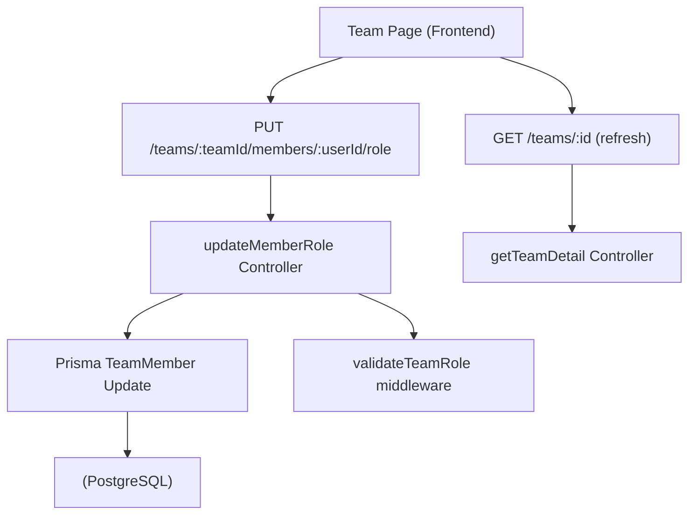
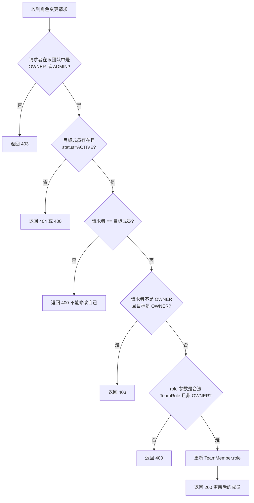

# 团队成员角色管理

Feature Name: team-role-management
Updated: 2026-06-21

## Description

为团队管理模块增加角色变更能力，将团队角色从 ADMIN/MEMBER 两级扩展为 OWNER/ADMIN/MODERATOR/MEMBER 四级，并允许 OWNER 和 ADMIN 角色的成员变更其他成员的角色等级。

## Architecture



## Components and Interfaces

### 1. 数据库变更

**文件**: `backend/prisma/schema.prisma`

将 TeamRole 枚举从:

```prisma
enum TeamRole {
  ADMIN
  MEMBER
}
```

扩展为:

```prisma
enum TeamRole {
  OWNER
  ADMIN
  MODERATOR
  MEMBER
}
```

**数据迁移策略**:

- 现有走邀请码加入的成员 role 保持 `MEMBER` 不变（已是默认值）
- 通过创建团队得到的 role=`ADMIN` 的记录，需要根据 `Team.ownerId` 判断：
  - 若 `TeamMember.userId === Team.ownerId`，将 role 更新为 `OWNER`
  - 其他 role=`ADMIN` 的记录保持 `ADMIN`

### 2. API 端点

**新增路由**: `PUT /teams/:teamId/members/:userId/role`

**请求体**:
```json
{
  "role": "ADMIN" | "MODERATOR" | "MEMBER"
}
```

**成功响应** (200):
```json
{
  "id": "clx...",
  "teamId": "clx...",
  "userId": "clx...",
  "role": "ADMIN",
  "status": "ACTIVE",
  "updatedAt": "2026-06-21T00:00:00.000Z"
}
```

**权限**: 请求者需在团队中为 OWNER 或 ADMIN 角色（团队级权限，非系统级）

**控制器**: `backend/src/controllers/teamController.ts` 新增 `updateMemberRole` 函数

### 3. 权限验证逻辑

控制器内的权限验证流程:



注意: API 不接受将成员设为 OWNER（OWNER 仅由创建团队产生）。

### 4. 前端组件

**修改文件**: `frontend/src/app/team/page.tsx`

在成员列表每行添加角色变更下拉菜单:
- 仅对 `isAdmin`（当前用户角色为 OWNER 或 ADMIN）且目标不是自己的 ACTIVE 成员显示
- ADMIN 用户不对 OWNER 角色成员显示
- 下拉选项排除目标当前角色和 OWNER 选项

## Data Models

### TeamMember (Prisma)

```prisma
model TeamMember {
  id       String     @id @default(cuid())
  teamId   String
  userId   String
  role     TeamRole   @default(MEMBER)
  status   JoinStatus @default(PENDING)
  joinedAt DateTime   @default(now())

  team Team @relation(fields: [teamId], references: [id], onDelete: Cascade)
  user User @relation(fields: [userId], references: [id], onDelete: Cascade)

  @@unique([teamId, userId])
  @@index([teamId])
  @@index([userId])
}
```

无新增字段，`updatedAt` 通过 Prisma 的 `@updatedAt`（当前 Team 模型已使用，但 TeamMember 模型未使用）。需要在 TeamMember 添加 `updatedAt` 字段。

### TeamRole 枚举

| 值 | 数值顺序 | 含义 |
|----|---------|------|
| OWNER | 0 | 团队创建者，不可被变更角色 |
| ADMIN | 1 | 管理员，可管理成员和变更角色 |
| MODERATOR | 2 | 协管员，高于成员 |
| MEMBER | 3 | 普通成员，默认角色 |

## Correctness Properties

1. 团队的 OWNER 始终有且仅有一个（即创建者）
2. OWNER 角色只能通过创建团队产生，不能通过角色变更 API 授予
3. OWNER 不可被非 OWNER 变更角色或移出团队
4. 成员不能修改自己的角色
5. 只有 ACTIVE 状态的成员才能被变更角色
6. TeamRole 枚举值与数据库存储保持一致

## Error Handling

| 场景 | HTTP 状态码 | 错误信息 |
|------|-----------|---------|
| 请求者非 OWNER/ADMIN | 403 | 权限不足：仅团队管理员可变更成员角色 |
| 目标成员不存在 | 404 | 成员不存在 |
| 目标成员非 ACTIVE | 400 | 仅可变更活跃成员的角色 |
| 尝试修改自己的角色 | 400 | 不能修改自己的角色 |
| 非 OWNER 修改 OWNER | 403 | 权限不足：不可修改团队创建者的角色 |
| 尝试设置为 OWNER | 400 | 无效的角色值 |
| 角色值非法 | 400 | 无效的角色值 |

## Test Strategy

1. **单元测试**: 测试 `updateMemberRole` 控制器各权限分支
2. **集成测试**: 
   - OWNER 变更 MEMBER 为 ADMIN 成功
   - ADMIN 变更 MEMBER 为 ADMIN 成功
   - ADMIN 变更其他 ADMIN 为 MODERATOR 成功
   - MEMBER 尝试变更他人角色失败 (403)
   - 修改自己角色失败 (400)
   - 修改 OWNER 角色失败 (403，当请求者为 ADMIN)
   - 修改非 ACTIVE 成员失败 (400)

## References

[^1]: `backend/prisma/schema.prisma#L10-L12` - TeamRole 枚举定义
[^2]: `backend/prisma/schema.prisma#L120-L134` - TeamMember 模型
[^3]: `backend/src/controllers/teamController.ts` - 团队控制器
[^4]: `backend/src/routes/teams.ts` - 团队路由
[^5]: `frontend/src/app/team/page.tsx` - 前端团队页面
