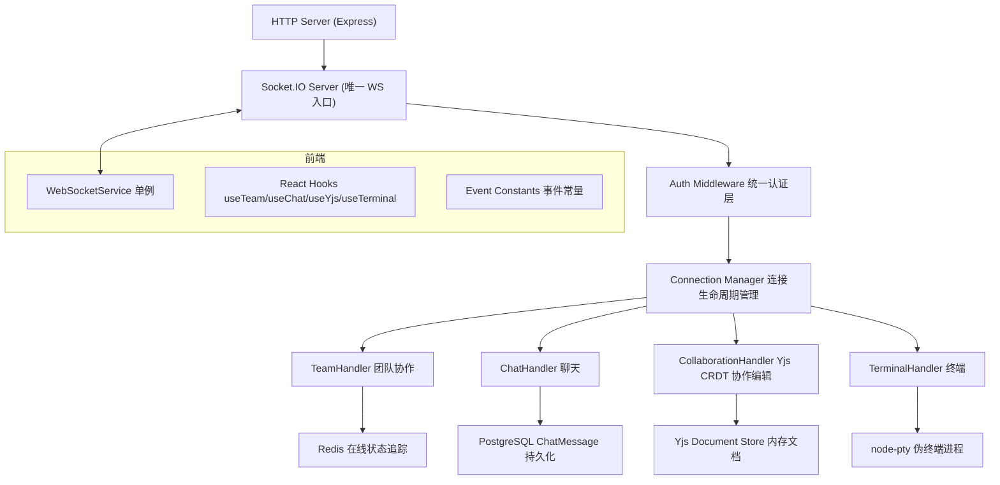

# WebSocket 模块重构设计方案

> 日期：2026-06-30
> 状态：设计完成，待确认

---

## 1. 问题分析

### 当前现状

项目中有三套并行的 WebSocket 机制：

| 通道 | 协议 | 用途 |
|------|------|------|
| Socket.IO (`/socket.io`) | Socket.IO | 团队协作（code-change/cursor-move）+ 聊天 |
| 原生 ws (`/ws`) | ws | Yjs CRDT 协作编辑 |
| 原生 ws (`/terminal`) | ws | xterm.js 终端 |

### 核心问题

1. **三套独立认证**：JWT token 提取逻辑在 `WebSocketHandler.ts`、`yServer.ts`、`TerminalServer.ts` 中分别实现
2. **两套代码同步并存**：Socket.IO 手动全量同步（CodeEditor.tsx）+ Yjs CRDT（CollaborativeEditor/CollaborativeEditorCore）
3. **大量重复代码**：`AuthenticatedSocket` 接口重复定义、`hashCode`/`USER_COLORS` 重复、`extractToken` 重复
4. **事件命名不一致**：`code:change` vs `code-change` 混用
5. **连接初始化分散**：login.tsx / register.tsx / Header.tsx / ChatRoom.tsx 四处调用 `wsService.connect()`
6. **全局 IO 引用**：`notificationService.ts` 通过全局变量持有 `io` 实例
7. **Yjs 连接无认证**：前端 WebsocketProvider 未传 token，后端认证逻辑形同虚设

### 重构目标

- Socket.IO 为唯一 WebSocket 入口
- 统一认证、统一事件命名、统一连接管理
- 每个模块职责单一、边界清晰
- 前端通过 React hooks 封装业务逻辑
- 删除所有重复代码和废弃组件

---

## 2. 整体架构



核心变化：
- 移除两个原生 ws 服务器（`yServer.ts` 和 `TerminalServer.ts`）
- Yjs 通过 `y-socket.io` 适配器走 Socket.IO
- 终端通过 Socket.IO 事件桥接 node-pty
- 认证中间件统一为单一入口

---

## 3. 后端模块设计

### 3.1 目录结构

```
backend/src/websocket/
├── index.ts                    # 统一初始化入口，创建 IO 实例并注册所有 handler
├── auth.ts                     # Socket.IO 握手认证中间件（JWT 验证）
├── types.ts                    # AuthenticatedSocket 类型、事件名常量、消息接口
├── connection-manager.ts       # 连接生命周期管理、Redis 在线追踪、广播工具方法
├── team-handler.ts             # 团队协作处理器（join/leave team、在线用户广播）
├── chat-handler.ts             # 聊天处理器（房间管理、消息持久化、输入状态）
├── collaboration-handler.ts   # Yjs 协作编辑（y-socket.io 适配器、文档管理）
├── terminal-handler.ts        # 终端处理器（Socket.IO 事件桥接 node-pty）
```

### 3.2 认证层（auth.ts）

所有 handler 共享同一个认证中间件：

```typescript
// 注册到 Socket.IO 全局中间件
io.use(async (socket, next) => {
  const token = socket.handshake.auth.token as string;
  if (!token) return next(new Error('Authentication required'));

  try {
    const decoded = jwt.verify(token, JWT_SECRET) as { userId: string };
    socket.data.userId = decoded.userId;
    next();
  } catch {
    next(new Error('Invalid token'));
  }
});
```

需要项目权限的 handler（collaboration、terminal）在各自的连接事件中通过 projectId 做二次校验。

### 3.3 连接管理器（connection-manager.ts）

```typescript
class ConnectionManager {
  private io: Server;

  constructor(io: Server) { this.io = io; }

  // 连接时记录到 Redis，广播在线状态
  async onConnect(socket: AuthenticatedSocket): void;

  // 断开时清理 Redis 记录、清理 PTY 进程
  async onDisconnect(socket: AuthenticatedSocket): void;

  // 获取团队在线用户
  async getTeamOnlineUsers(teamId: string): Promise<string[]>;

  // 向指定用户推送
  sendToUser(userId: string, event: string, data: any): void;

  // 向团队广播
  broadcastToTeam(teamId: string, event: string, data: any): void;

  // 推送通知（数据库持久化 + 实时推送）
  async pushNotification(userId: string, notification: NotificationData): Promise<void>;
}
```

### 3.4 事件命名规范（types.ts）

所有事件名采用 `namespace:action` 格式：

```typescript
export const EVENTS = {
  // 团队协作
  TEAM_JOIN: 'team:join',
  TEAM_LEAVE: 'team:leave',
  TEAM_ONLINE: 'team:online',

  // 聊天
  CHAT_JOIN: 'chat:join',
  CHAT_LEAVE: 'chat:leave',
  CHAT_MESSAGE_SEND: 'chat:message:send',
  CHAT_MESSAGE_RECEIVE: 'chat:message:receive',
  CHAT_HISTORY: 'chat:history',
  CHAT_TYPING_START: 'chat:typing:start',
  CHAT_TYPING_STOP: 'chat:typing:stop',

  // 协作编辑 (Yjs)
  COLLAB_JOIN: 'collab:join',
  COLLAB_LEAVE: 'collab:leave',

  // 终端
  TERM_INIT: 'term:init',
  TERM_INPUT: 'term:input',
  TERM_OUTPUT: 'term:output',
  TERM_RESIZE: 'term:resize',

  // 通知
  NOTIFICATION: 'notification',
} as const;
```

### 3.5 团队协作处理器（team-handler.ts）

```typescript
class TeamHandler {
  private connMgr: ConnectionManager;

  register(io: Server): void {
    io.on('connection', (socket: AuthenticatedSocket) => {
      socket.join(`user:${socket.data.userId}`);

      socket.on(EVENTS.TEAM_JOIN, (teamId: string) => {
        socket.join(`team:${teamId}`);
        this.connMgr.broadcastToTeam(teamId, EVENTS.TEAM_ONLINE, { ... });
      });

      socket.on(EVENTS.TEAM_LEAVE, (teamId: string) => {
        socket.leave(`team:${teamId}`);
        this.connMgr.broadcastToTeam(teamId, EVENTS.TEAM_ONLINE, { ... });
      });
    });
  }
}
```

### 3.6 聊天处理器（chat-handler.ts）

保持现有逻辑，迁移事件名为新规范：

- `chat:join` -> 加入聊天房间，加载历史消息
- `chat:message:send` -> 保存消息到数据库，广播到房间
- `chat:typing:start/stop` -> 广播输入状态

### 3.7 协作编辑处理器（collaboration-handler.ts）

使用 `y-socket.io` 适配器替代 `y-websocket`：

```typescript
import { YSocketIO } from 'y-socket.io/dist/server';

class CollaborationHandler {
  private ysocketio: YSocketIO;

  constructor(io: Server) {
    this.ysocketio = new YSocketIO(io);
    this.ysocketio.initialize();

    // 在 YSocketIO 的认证钩子中做项目权限校验
    this.ysocketio.on('document-loaded', (doc: Y.Doc) => {
      // 文档加载后的初始化逻辑
    });
  }
}
```

- 不再需要独立的 `ws.Server` 实例
- 文档管理由 `y-socket.io` 内部处理
- 前端使用 `y-socket.io` 客户端 provider

### 3.8 终端处理器（terminal-handler.ts）

使用 Socket.IO 事件桥接 node-pty：

```typescript
class TerminalHandler {
  private sessions: Map<string, pty.IPty> = new Map();

  register(io: Server): void {
    io.on('connection', (socket: AuthenticatedSocket) => {
      socket.on(EVENTS.TERM_INIT, async ({ projectId }: { projectId: string }) => {
        // 二次校验项目权限
        // 创建 pty 进程
        const ptyProcess = pty.spawn('bash', [], { cols: 80, rows: 24 });
        this.sessions.set(socket.id, ptyProcess);

        ptyProcess.onData((data: string) => {
          socket.emit(EVENTS.TERM_OUTPUT, data);
        });
      });

      socket.on(EVENTS.TERM_INPUT, (data: string) => {
        this.sessions.get(socket.id)?.write(data);
      });

      socket.on(EVENTS.TERM_RESIZE, ({ cols, rows }: { cols: number, rows: number }) => {
        this.sessions.get(socket.id)?.resize(cols, rows);
      });

      socket.on('disconnect', () => {
        this.sessions.get(socket.id)?.kill();
        this.sessions.delete(socket.id);
      });
    });
  }
}
```

### 3.9 统一初始化入口（index.ts）

```typescript
export function initializeWebSocket(httpServer: http.Server) {
  const io = new Server(httpServer, {
    cors: { origin: '*', methods: ['GET', 'POST'] },
    adapter: createAdapter(), // Redis adapter
  });

  // 认证中间件
  io.use(wsAuth);

  // 连接管理器
  const connMgr = new ConnectionManager(io);

  // 注册各 handler
  const teamHandler = new TeamHandler(connMgr);
  const chatHandler = new ChatHandler(connMgr);
  const collabHandler = new CollaborationHandler(io);
  const terminalHandler = new TerminalHandler();

  teamHandler.register(io);
  chatHandler.register(io);
  terminalHandler.register(io);
  // collabHandler 通过 y-socket.io 初始化

  // 统一连接生命周期
  io.on('connection', (socket) => {
    connMgr.onConnect(socket);
    socket.on('disconnect', () => connMgr.onDisconnect(socket));
  });

  return { io, connMgr };
}
```

---

## 4. 前端设计

### 4.1 目录结构

```
frontend/src/lib/websocket/
├── index.ts          # WebSocketService 单例（精简版，仅连接管理）
├── events.ts         # 事件常量（与后端 types.ts 保持一致）
├── hooks.ts          # React hooks：useTeam / useChat / useYjs / useTerminal / useNotification
└── types.ts          # 前端类型定义
```

### 4.2 WebSocketService（index.ts）

精简为仅负责连接生命周期管理：

```typescript
class WebSocketService {
  private socket: Socket | null = null;

  connect(token: string): void {
    if (this.socket?.connected) return;
    if (this.socket) return; // 已有实例但未连接，不允许重复创建

    this.socket = io(wsUrl(), {
      auth: { token },
      reconnection: true,
      reconnectionAttempts: 5,
      reconnectionDelay: 3000,
      reconnectionDelayMax: 60000,
    });

    this.socket.on('connect', () => store.setState({ isConnected: true }));
    this.socket.on('disconnect', () => store.setState({ isConnected: false }));
  }

  disconnect(): void {
    this.socket?.disconnect();
    this.socket = null;
  }

  getSocket(): Socket | null { return this.socket; }
}

export const wsService = new WebSocketService();
```

### 4.3 React Hooks（hooks.ts）

**useTeam(teamId)**

```typescript
export function useTeam(teamId: string | null) {
  const { isConnected } = useWebSocketStore();
  const [onlineUsers, setOnlineUsers] = useState<string[]>([]);

  useEffect(() => {
    if (!isConnected || !teamId) return;
    const socket = wsService.getSocket()!;

    socket.emit(EVENTS.TEAM_JOIN, teamId);
    socket.on(EVENTS.TEAM_ONLINE, (data) => setOnlineUsers(data.users));
    socket.on(EVENTS.NOTIFICATION, handleNotification);

    return () => {
      socket.emit(EVENTS.TEAM_LEAVE, teamId);
      socket.off(EVENTS.TEAM_ONLINE);
      socket.off(EVENTS.NOTIFICATION);
    };
  }, [isConnected, teamId]);

  return { onlineUsers };
}
```

**useChat(roomId)**

```typescript
export function useChat(roomId: string | null) {
  const [messages, setMessages] = useState<ChatMessage[]>([]);
  const [typingUsers, setTypingUsers] = useState<string[]>([]);

  useEffect(() => {
    if (!roomId) return;
    const socket = wsService.getSocket()!;

    socket.emit(EVENTS.CHAT_JOIN, roomId);
    socket.on(EVENTS.CHAT_HISTORY, (data) => setMessages(data.messages));
    socket.on(EVENTS.CHAT_MESSAGE_RECEIVE, (msg) => setMessages(prev => [...prev, msg]));
    socket.on(EVENTS.CHAT_TYPING_START, (data) => setTypingUsers(prev => [...prev, data.userId]));
    socket.on(EVENTS.CHAT_TYPING_STOP, (data) => setTypingUsers(prev => prev.filter(id => id !== data.userId)));

    return () => {
      socket.emit(EVENTS.CHAT_LEAVE, roomId);
      socket.off(EVENTS.CHAT_HISTORY);
      socket.off(EVENTS.CHAT_MESSAGE_RECEIVE);
      socket.off(EVENTS.CHAT_TYPING_START);
      socket.off(EVENTS.CHAT_TYPING_STOP);
    };
  }, [roomId]);

  const sendMessage = useCallback((content: string) => {
    wsService.getSocket()?.emit(EVENTS.CHAT_MESSAGE_SEND, { roomId, content });
  }, [roomId]);

  return { messages, typingUsers, sendMessage, /* ... */ };
}
```

**useYjs(docId, userId, userName)**

```typescript
export function useYjs(docId: string, userId: string, userName: string) {
  const ydocRef = useRef<Y.Doc | null>(null);
  const providerRef = useRef<YSocketIOProvider | null>(null);

  useEffect(() => {
    const socket = wsService.getSocket()!;
    const ydoc = new Y.Doc();
    const provider = new YSocketIOProvider(
      `${wsUrl()}/${docId}`, // y-socket.io 的 namespace/path
      docId,
      ydoc,
      { auth: { userId, userName } }
    );

    ydocRef.current = ydoc;
    providerRef.current = provider;

    return () => {
      provider.destroy();
      ydoc.destroy();
    };
  }, [docId]);

  return { ydoc: ydocRef, provider: providerRef };
}
```

**useTerminal(projectId)**

```typescript
export function useTerminal(projectId: string, terminalRef: React.RefObject<Terminal>) {
  useEffect(() => {
    const socket = wsService.getSocket()!;
    socket.emit(EVENTS.TERM_INIT, { projectId });

    const dataHandler = (data: string) => terminalRef.current?.write(data);
    socket.on(EVENTS.TERM_OUTPUT, dataHandler);

    return () => {
      socket.off(EVENTS.TERM_OUTPUT, dataHandler);
    };
  }, [projectId]);

  const sendInput = useCallback((data: string) => {
    wsService.getSocket()?.emit(EVENTS.TERM_INPUT, data);
  }, []);

  const sendResize = useCallback((cols: number, rows: number) => {
    wsService.getSocket()?.emit(EVENTS.TERM_RESIZE, { cols, rows });
  }, []);

  return { sendInput, sendResize };
}
```

### 4.4 事件常量（events.ts）

与后端 `types.ts` 完全一致的常量定义，确保前后端事件名同步。

### 4.5 连接初始化统一入口

**唯一入口**：Header 组件在用户登录后调用 `wsService.connect(token)`。

移除以下文件中的 connect 调用：
- `frontend/src/app/login/page.tsx`
- `frontend/src/app/register/page.tsx`
- `frontend/src/components/ChatRoom.tsx`

### 4.6 组件变更清单

| 当前文件 | 操作 | 说明 |
|----------|------|------|
| `CodeEditor.tsx` | **修改** | 删除 `code-change`/`cursor-move` Socket.IO 同步逻辑，使用 `useYjs` hook |
| `CollaborativeEditor.tsx` | **删除** | 简化版 Yjs 实现，功能与 Core 重复 |
| `CollaborativeEditorCore.tsx` | **重命名**为 `CollaborativeEditor.tsx` | 作为唯一协作编辑器实现，改用 `useYjs` hook |
| `TerminalPanel.tsx` | **修改** | 原生 WebSocket 替换为 `useTerminal` hook |
| `Header.tsx` | **修改** | 使用 `useTeam` + `useNotification` hooks |
| `ChatRoom.tsx` | **修改** | 使用 `useChat` hook，移除重复的 connect 调用 |

---

## 5. 待删除文件和代码

### 后端删除

| 文件 | 原因 |
|------|------|
| `backend/src/collaboration/yServer.ts` | 原生 ws 服务器，由 collaboration-handler.ts 替代 |
| `backend/src/terminal/TerminalServer.ts` | 原生 ws 服务器，由 terminal-handler.ts 替代 |
| `backend/src/websocket/WebSocketHandler.ts` | 拆分为 auth.ts + connection-manager.ts + team-handler.ts |
| `backend/src/websocket/ChatWebSocketHandler.ts` | 重构为 chat-handler.ts |
| `backend/src/types/y-websocket.d.ts` | 不再使用 y-websocket |

### 后端保留并修改

| 文件 | 修改内容 |
|------|----------|
| `backend/src/index.ts` | 将现有 4 个 WS 初始化调用替换为 `initializeWebSocket()` 单一调用 |
| `backend/src/lib/notificationService.ts` | 改为通过 ConnectionManager 注入，移除全局 IO 变量 |
| `backend/src/terminal/TerminalManager.ts` | 保留但由 terminal-handler.ts 调用（不再由 TerminalServer.ts 驱动） |

### 新增依赖

| 依赖 | 用途 |
|------|------|
| `y-socket.io` (npm) | Yjs 通过 Socket.IO 同步的适配器（替代 y-websocket） |

### 前端删除

| 文件 | 原因 |
|------|------|
| `CollaborativeEditor.tsx` | 功能与 CollaborativeEditorCore 重复 |

### 前端修改

| 文件 | 修改内容 |
|------|----------|
| `lib/websocket.ts` | 精简为连接管理 + 事件常量，业务逻辑移至 hooks |
| `stores/websocketStore.ts` | 保留 `isConnected`，移除 `onlineCount`（交给 useTeam） |
| `components/Header.tsx` | 使用 useTeam/useNotification hooks |
| `components/CodeEditor.tsx` | Socket.IO 同步逻辑替换为 useYjs |
| `components/ChatRoom.tsx` | 使用 useChat hook |
| `components/TerminalPanel.tsx` | 原生 ws 替换为 useTerminal hook |
| `app/login/page.tsx` | 移除 `wsService.connect()` |
| `app/register/page.tsx` | 移除 `wsService.connect()` |

---

## 6. 风险评估

| 风险 | 影响 | 缓解措施 |
|------|------|---------|
| `y-socket.io` 与现有 y-websocket 行为差异 | 协作编辑功能异常 | 先在独立分支验证同步、awareness、断线重连是否正常 |
| Socket.IO 终端桥接的性能 | 终端输入延迟 | node-pty 输出天然分段，Socket.IO 的二进制帧足够高效。如遇问题可添加 throttling |
| 大量文件变更引入回归 bug | 功能回归 | 逐步实施，每个模块独立验证后再进入下一个 |
| 多 tab 连接冲突 | 同一用户多 tab 导致 Redis 状态混乱 | 每个 socket 独立追踪，按 socket.id 去重 |

---

## 7. 实施顺序

1. **Phase 1**：后端 `auth.ts` + `types.ts` + `connection-manager.ts` 基础设施
2. **Phase 2**：后端 `team-handler.ts`（依赖 connection-manager）
3. **Phase 3**：后端 `chat-handler.ts`（依赖 connection-manager）
4. **Phase 4**：后端 `collaboration-handler.ts`（Yjs 替换 y-websocket）
5. **Phase 5**：后端 `terminal-handler.ts`（终端替换原生 ws）
6. **Phase 6**：后端 `index.ts` 统一初始化 + 清理旧代码
7. **Phase 7**：前端 `events.ts` + `types.ts` 基础设施
8. **Phase 8**：前端 hooks 实现 + WebSocketService 精简
9. **Phase 9**：前端组件改造（Header -> ChatRoom -> CodeEditor -> TerminalPanel）
10. **Phase 10**：清理废弃文件 + 全功能回归测试
