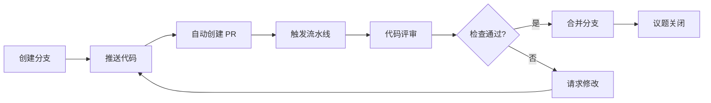
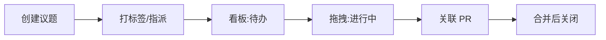

# CodeZone · 产品需求文档 (PRD)

## 1. 产品概述

CodeZone 是一个面向编程团队的一体化协作开发平台，将代码仓库、议题追踪、合并请求评审、团队讨论、文档知识库与流水线可视化整合在同一个克制、专注的工作空间中。

- **解决问题**：消除团队在 Git 托管、项目管理、即时通讯、文档之间频繁切换上下文的摩擦，让"写代码—评审—交付"形成一条连贯的节奏。
- **目标用户**：5–500 人的软件研发团队，包括开发者、技术负责人、产品经理与设计工程师。
- **市场价值**：以"留白即写作"的 Yohaku 设计哲学降低工具噪音，把注意力还给内容本身，让长会话与代码评审像阅读信纸一样自然。

## 2. 核心功能

### 2.1 用户角色

| 角色 | 注册方式 | 核心权限 |
|------|----------|----------|
| 普通成员 | 邮箱注册 / 邀请加入 | 浏览仓库、提交议题、参与评审与讨论 |
| 维护者 | 组织管理员指派 | 上述全部 + 合并分支、管理标签与里程碑 |
| 组织管理员 | 创建组织 | 上述全部 + 成员管理、计费与组织级设置 |

### 2.2 功能模块

1. **工作台 (Dashboard)**：个人活动概览、待办事项、跨仓库动态流、快捷入口与统计卡片。
2. **项目与仓库 (Repos)**：项目列表、仓库文件树浏览、代码阅读器、提交历史。
3. **议题 (Issues)**：议题列表 / 看板双视图、标签、里程碑、指派与筛选。
4. **合并请求 (Pull Requests)**：PR 列表、Diff 评审、行内评论、状态检查与合并操作。
5. **讨论 (Discussions)**：分类话题列表、多级评论线程、置顶与标记已解决。
6. **文档库 (Wiki)**：Markdown 文档树、实时预览、目录大纲、版本历史。
7. **流水线 (Pipelines)**：CI/CD 运行列表、阶段可视化、日志流、触发与重试。
8. **团队 (Team)**：成员名册、角色管理、团队分组与权限概览。
9. **设置 (Settings)**：个人资料、通知偏好、外观主题、SSH/令牌管理。

### 2.3 页面详情

| 页面 | 模块 | 功能描述 |
|------|------|----------|
| 工作台 | 活动流 | 聚合最近提交/评论/议题动态，按时间倒序，呼吸式入场 |
| 工作台 | 待办卡片 | 待评审 PR、指派给我的议题、@提及通知计数 |
| 工作台 | 统计概览 | 本周提交数、合并数、待评审数、流水线通过率 |
| 仓库列表 | 仓库卡片 | 仓库名、描述、语言色点、星标、最近更新 |
| 代码浏览 | 文件树 + 阅读器 | 左侧文件树，右侧语法高亮代码，支持 README 渲染 |
| 提交历史 | 提交列表 | 提交消息、作者头像、SHA、相对时间、diff 摘要 |
| 议题看板 | 看板列 | 待办 / 进行中 / 评审中 / 完成，卡片拖拽流转 |
| 议题详情 | 讨论区 | 描述、评论线程、侧边栏标签/指派/里程碑 |
| PR 评审 | Diff 视图 | 统一/分屏切换、行内评论、文件树导航、检查状态 |
| PR 评审 | 合并操作 | 合并按钮、三种合并策略、冲突提示 |
| 讨论 | 话题列表 | 分类标签、回复数、最后活跃时间 |
| 文档库 | 编辑器 | Markdown 编辑 + 预览、目录大纲、保存草稿 |
| 流水线 | 运行详情 | 阶段卡片、耗时、日志终端、重试/取消按钮 |
| 团队 | 成员名册 | 头像、姓名、角色、最近活跃、操作菜单 |
| 设置 | 偏好 | 主题切换、字号、通知开关、会话管理 |

## 3. 核心流程

**提交流程**：开发者创建分支 → 推送代码 → 系统自动创建 PR → 触发流水线 → 评审者行内评论 → 维护者合并 → 议题自动关闭。

**议题流转**：任何人创建议题 → 添加标签/指派 → 看板拖拽至进行中 → 提交 PR 关联议题 → 合并后自动关闭。

## 4. 用户界面设计

### 4.1 设计风格

采用 **Yohaku（余白）设计系统** —— 以"留白即写作"为核心理念，克制、专注、呼吸式。

- **主色**：浅葱 `#33A6B8`（浅色）/ 桃 `#F596AA`（深色）作为强调色，仅出现在 CTA、焦点环、品牌标记，占比 ≤ 5%
- **中性灰**：三档十级 `neutral-1`~`neutral-10`，浅色带纸张暖意（R>G>B），深色沉入暖灰
- **纸面底色**：浅色 `#fefefb`（纸张本白），深色 `rgb(28,28,30)`（暖灰夜色）
- **按钮**：克制圆角（`rounded-md` 6px），无硬阴影，以 `ring-1 ring-border` 承载分层；主 CTA 强调色填充白字
- **字体**：标题用衬线（Noto Serif CJK SC / Source Han Serif），正文用无衬线（Inter + CJK 回退），代码用等宽（Operator Mono / JetBrains Mono）
- **字号**：基础 14px，角色化令牌 `copy-14 / title-20/24/28 / display-36/48`，CJK 永不 `font-bold`
- **布局**：桌面优先，左侧持久导航 + 顶部上下文栏 + 主内容区，宽留白节奏
- **图标**：lucide-react 线性图标，`icon-sm/md/lg` 三档
- **动效**：呼吸式入场（`cubic-bezier(0.22, 1, 0.36, 1)`），悬停仅颜色微深，无跳跃高亮

### 4.2 页面设计概览

| 页面 | 模块 | UI 元素 |
|------|------|---------|
| 工作台 | 活动流 | 纸面背景、衬线标题、时间轴左线 accent、卡片 `bg-neutral-2 ring-border` |
| 工作台 | 统计卡片 | 大号 `display-36` 数字 + `label-12` 标签，呼吸式计数动画 |
| 仓库列表 | 仓库卡片 | 语言色点、`copy-14` 描述、悬停 `bg-neutral-3` |
| 代码浏览 | 阅读器 | 等宽字体、行号、`bg-neutral-1` 代码块、`ring-border` |
| 议题看板 | 看板列 | 四列横向滚动、卡片拖拽、标签 chip、`rounded-lg` |
| PR 评审 | Diff | 增删行色带、行内评论气泡、文件树侧栏 |
| 文档库 | 编辑器 | 左树+中编辑+右预览，`prose` 排版，drop cap 首字下沉 |
| 流水线 | 阶段卡片 | 横向步骤条、状态色点、日志终端 `font-mono` |
| 设置 | 偏好 | 主题切换卡、字号选择、开关列表 |

### 4.3 响应式

桌面优先（≥1024px 完整三栏），平板（768–1023px）折叠侧栏为图标栏，移动端（<768px）隐藏侧栏改抽屉式，代码 Diff 自动转单栏，看板转纵向堆叠。触摸目标 ≥ 44px。

### 4.4 主题

支持浅色（默认）/ 深色双主题，遵循 Yohaku 契约：浅色纸白 + 浅葱强调；深色暖灰 + 桃强调。主题切换通过 `data-theme` 属性 + CSS 变量反转，无闪烁过渡。

## 5. 非功能性需求

- **性能**：首屏 LCP < 2.5s，路由切换 < 200ms，长列表虚拟滚动
- **可访问性**：WCAG AA 对比度，键盘可达，语义化 HTML，ARIA 标签
- **可维护性**：组件 < 200 行，单一职责，设计令牌统一管理
- **可扩展性**：模块化路由，API 分层（Controller → Service → Repository）
