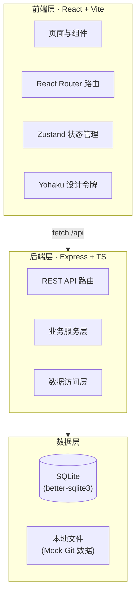
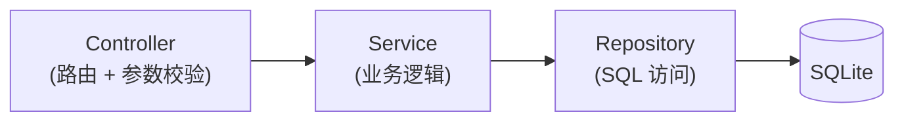
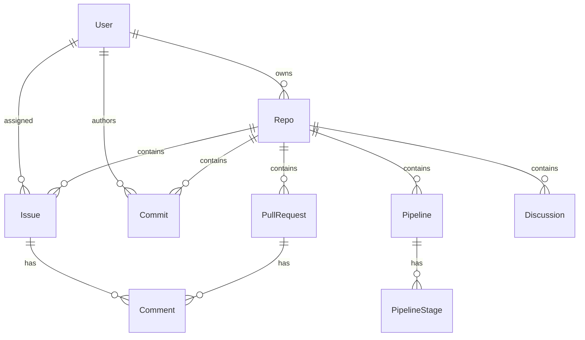

# CodeZone · 技术架构文档

## 1. 架构设计



前后端同仓 Monorepo 结构，前端通过 `/api` 前缀代理到 Express 后端，后端以 better-sqlite3 嵌入式数据库持久化，零外部服务依赖，开箱即用。

## 2. 技术说明

- **前端**：React 18 + TypeScript + Vite + Tailwind CSS + React Router + Zustand
- **初始化工具**：vite-init（react-express-ts 模板）
- **后端**：Express 4 + TypeScript（ESM）
- **数据库**：SQLite（better-sqlite3，嵌入式，无需额外服务）
- **设计系统**：Yohaku 设计令牌（移植到 Tailwind v3 config + CSS 变量）
- **图标**：lucide-react
- **代码高亮**：Prism / Shiki 轻量方案
- **Markdown**：react-markdown + remark-gfm

## 3. 路由定义

| 路由 | 用途 |
|------|------|
| `/` | 重定向至工作台 |
| `/dashboard` | 工作台首页 |
| `/repos` | 仓库列表 |
| `/repos/:repoId` | 仓库概览 |
| `/repos/:repoId/code/*` | 代码浏览（文件树 + 阅读器） |
| `/repos/:repoId/commits` | 提交历史 |
| `/repos/:repoId/issues` | 议题列表 |
| `/repos/:repoId/issues/board` | 议题看板 |
| `/repos/:repoId/issues/:issueId` | 议题详情 |
| `/repos/:repoId/pulls` | 合并请求列表 |
| `/repos/:repoId/pulls/:prId` | PR 评审 |
| `/repos/:repoId/discussions` | 讨论列表 |
| `/repos/:repoId/wiki` | 文档库 |
| `/repos/:repoId/pipelines` | 流水线列表 |
| `/repos/:repoId/pipelines/:runId` | 运行详情 |
| `/team` | 团队成员 |
| `/settings` | 个人设置 |

## 4. API 定义

核心 REST 端点（均挂载在 `/api` 下）：

```typescript
// 仓库
GET    /api/repos                       // 仓库列表
GET    /api/repos/:repoId               // 仓库详情
GET    /api/repos/:repoId/contents/*    // 文件内容
GET    /api/repos/:repoId/commits       // 提交历史

// 议题
GET    /api/repos/:repoId/issues        // 议题列表（支持 ?status=&label=）
POST   /api/repos/:repoId/issues        // 创建议题
PATCH  /api/repos/:repoId/issues/:id    // 更新议题（状态/标签/指派）

// 合并请求
GET    /api/repos/:repoId/pulls         // PR 列表
GET    /api/repos/:repoId/pulls/:id     // PR 详情 + diff
POST   /api/repos/:repoId/pulls/:id/comments  // 行内评论

// 讨论
GET    /api/repos/:repoId/discussions   // 讨论列表

// 流水线
GET    /api/repos/:repoId/pipelines     // 运行列表
GET    /api/pipelines/:runId            // 运行详情 + 日志

// 团队
GET    /api/team                        // 成员名册

// 工作台
GET    /api/dashboard/activities        // 活动流
GET    /api/dashboard/stats             // 统计概览
```

响应统一格式：

```typescript
interface ApiResponse<T> {
  data: T;
  message?: string;
}
```

## 5. 服务端架构



- **Controller**：解析请求、校验参数、调用 Service、返回统一响应
- **Service**：编排业务逻辑、跨表事务
- **Repository**：封装 better-sqlite3 prepared statement，返回类型化实体

## 6. 数据模型

### 6.1 数据模型定义



### 6.2 数据定义语言

```sql
-- 用户
CREATE TABLE IF NOT EXISTS users (
  id TEXT PRIMARY KEY,
  name TEXT NOT NULL,
  email TEXT UNIQUE NOT NULL,
  avatar TEXT,
  role TEXT DEFAULT 'member',  -- member | maintainer | admin
  created_at INTEGER NOT NULL
);

-- 仓库
CREATE TABLE IF NOT EXISTS repos (
  id TEXT PRIMARY KEY,
  name TEXT NOT NULL,
  description TEXT,
  language TEXT,            -- 主语言
  language_color TEXT,      -- 语言色点
  stars INTEGER DEFAULT 0,
  default_branch TEXT DEFAULT 'main',
  owner_id TEXT NOT NULL,
  updated_at INTEGER NOT NULL,
  FOREIGN KEY (owner_id) REFERENCES users(id)
);

-- 议题
CREATE TABLE IF NOT EXISTS issues (
  id TEXT PRIMARY KEY,
  repo_id TEXT NOT NULL,
  number INTEGER NOT NULL,
  title TEXT NOT NULL,
  body TEXT,
  status TEXT DEFAULT 'open',  -- open | in_progress | review | closed
  priority TEXT DEFAULT 'normal',
  assignee_id TEXT,
  milestone TEXT,
  created_at INTEGER NOT NULL,
  FOREIGN KEY (repo_id) REFERENCES repos(id),
  FOREIGN KEY (assignee_id) REFERENCES users(id)
);

-- 标签
CREATE TABLE IF NOT EXISTS labels (
  id TEXT PRIMARY KEY,
  repo_id TEXT NOT NULL,
  name TEXT NOT NULL,
  color TEXT NOT NULL,
  FOREIGN KEY (repo_id) REFERENCES repos(id)
);

-- 议题-标签关联
CREATE TABLE IF NOT EXISTS issue_labels (
  issue_id TEXT NOT NULL,
  label_id TEXT NOT NULL,
  PRIMARY KEY (issue_id, label_id)
);

-- 合并请求
CREATE TABLE IF NOT EXISTS pull_requests (
  id TEXT PRIMARY KEY,
  repo_id TEXT NOT NULL,
  number INTEGER NOT NULL,
  title TEXT NOT NULL,
  body TEXT,
  status TEXT DEFAULT 'open',  -- open | merged | closed
  author_id TEXT NOT NULL,
  source_branch TEXT NOT NULL,
  target_branch TEXT NOT NULL,
  additions INTEGER DEFAULT 0,
  deletions INTEGER DEFAULT 0,
  created_at INTEGER NOT NULL,
  FOREIGN KEY (repo_id) REFERENCES repos(id),
  FOREIGN KEY (author_id) REFERENCES users(id)
);

-- 提交
CREATE TABLE IF NOT EXISTS commits (
  id TEXT PRIMARY KEY,
  repo_id TEXT NOT NULL,
  sha TEXT NOT NULL,
  message TEXT NOT NULL,
  author_id TEXT NOT NULL,
  additions INTEGER DEFAULT 0,
  deletions INTEGER DEFAULT 0,
  created_at INTEGER NOT NULL,
  FOREIGN KEY (repo_id) REFERENCES repos(id),
  FOREIGN KEY (author_id) REFERENCES users(id)
);

-- 评论（通用，用于议题/PR/讨论）
CREATE TABLE IF NOT EXISTS comments (
  id TEXT PRIMARY KEY,
  target_type TEXT NOT NULL,  -- issue | pull | discussion
  target_id TEXT NOT NULL,
  author_id TEXT NOT NULL,
  body TEXT NOT NULL,
  line_number INTEGER,        -- PR 行内评论用
  created_at INTEGER NOT NULL,
  FOREIGN KEY (author_id) REFERENCES users(id)
);

-- 流水线运行
CREATE TABLE IF NOT EXISTS pipelines (
  id TEXT PRIMARY KEY,
  repo_id TEXT NOT NULL,
  commit_sha TEXT NOT NULL,
  status TEXT DEFAULT 'pending',  -- pending | running | success | failed
  trigger TEXT DEFAULT 'push',
  created_at INTEGER NOT NULL,
  FOREIGN KEY (repo_id) REFERENCES repos(id)
);

-- 流水线阶段
CREATE TABLE IF NOT EXISTS pipeline_stages (
  id TEXT PRIMARY KEY,
  pipeline_id TEXT NOT NULL,
  name TEXT NOT NULL,
  status TEXT DEFAULT 'pending',
  duration_ms INTEGER,
  log TEXT,
  FOREIGN KEY (pipeline_id) REFERENCES pipelines(id)
);

-- 讨论
CREATE TABLE IF NOT EXISTS discussions (
  id TEXT PRIMARY KEY,
  repo_id TEXT NOT NULL,
  title TEXT NOT NULL,
  category TEXT,
  author_id TEXT NOT NULL,
  pinned INTEGER DEFAULT 0,
  created_at INTEGER NOT NULL,
  FOREIGN KEY (repo_id) REFERENCES repos(id),
  FOREIGN KEY (author_id) REFERENCES users(id)
);

CREATE INDEX IF NOT EXISTS idx_issues_repo ON issues(repo_id);
CREATE INDEX IF NOT EXISTS idx_issues_status ON issues(status);
CREATE INDEX IF NOT EXISTS idx_prs_repo ON pull_requests(repo_id);
CREATE INDEX IF NOT EXISTS idx_commits_repo ON commits(repo_id);
CREATE INDEX IF NOT EXISTS idx_comments_target ON comments(target_type, target_id);
```

初始数据通过 seed 脚本写入演示用户、仓库、议题与提交，确保首屏即有完整可交互内容。
